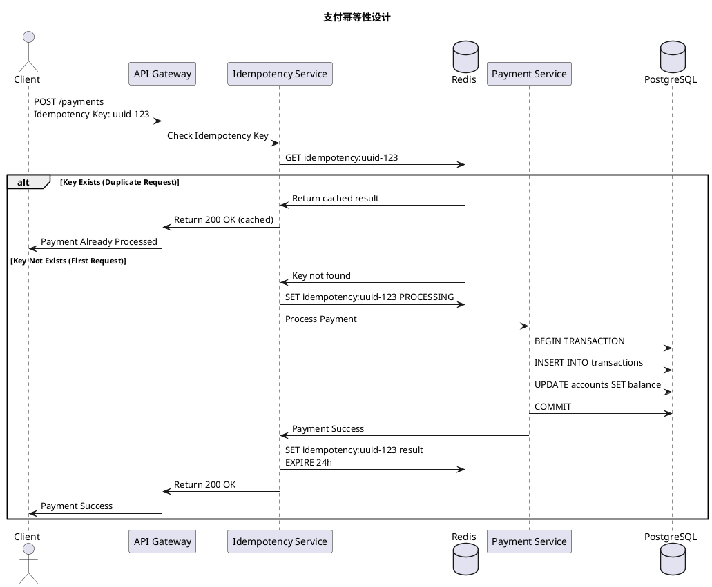

# PayPal 系统设计面试 - 准备分析

生成时间: 2025-11-13
职位: Staff Software Engineer - Backend Python

---

## 📊 现有设计评估

### ✅ 你已经有的设计（强项）

#### 1. **支付系统** ⭐⭐⭐⭐⭐ (最相关！)
**文件**: `payment_system_with_fraud_detection_and_reconciliation.puml`

**优点：**
- ✅ 包含风控系统（Fraud Detection）
- ✅ 包含对账系统（Reconciliation）
- ✅ 有支付路由（Payment Router）
- ✅ 有多支付方式适配器（Provider Adapter）

**需要加强：**
- ⚠️ **缺少幂等性设计** - 支付系统的核心！
- ⚠️ **缺少重试机制** - 网络失败、超时处理
- ⚠️ **缺少双向对账流程** - 与第三方的对账细节
- ⚠️ **缺少退款流程** - Refund/Chargeback
- ⚠️ **缺少账户余额管理** - Balance Service

**PayPal可能问到的点：**
1. "如何保证支付的幂等性？"
2. "如果第三方支付返回超时，你怎么处理？"
3. "对账系统如何处理差异（Discrepancy）？"
4. "如何设计退款流程？"

---

#### 2. **分布式事务** ⭐⭐⭐⭐⭐ (关键！)
**文件**: `distributed_transaction_management_system_with_2pc_and_saga.puml`

**优点：**
- ✅ 包含2PC和SAGA两种模式
- ✅ 有事务协调器
- ✅ 有状态管理

**需要加强：**
- ⚠️ **缺少补偿事务的详细流程** - SAGA失败时如何rollback
- ⚠️ **缺少超时处理** - 长事务的超时策略
- ⚠️ **缺少隔离级别讨论** - Read Committed vs Serializable

**PayPal可能问到的点：**
1. "在支付场景中，你会选择2PC还是SAGA？为什么？"
2. "SAGA失败后如何补偿？给出具体例子"
3. "如何处理补偿事务本身失败的情况？"

---

#### 3. **事件驱动架构** ⭐⭐⭐⭐
**文件**: `event_driven_architecture_with_kafka_and_microservices.puml`

**优点：**
- ✅ Kafka作为消息中间件
- ✅ 异步解耦
- ✅ 有监控系统

**需要加强：**
- ⚠️ **缺少事件顺序保证** - Kafka partition key策略
- ⚠️ **缺少重复消息处理** - 消费者幂等性
- ⚠️ **缺少死信队列** - Dead Letter Queue

**PayPal可能问到的点：**
1. "如何保证支付事件的顺序？"
2. "消费者如何处理重复消息？"
3. "Kafka消费者挂了，如何保证消息不丢失？"

---

#### 4. **分布式锁** ⭐⭐⭐⭐
**文件**: `distributed_lock_service_comprehensive.puml`

**优点：**
- ✅ Redis + ZooKeeper双方案
- ✅ 有死锁检测
- ✅ 有Watch Dog机制

**应用场景（PayPal）：**
- 防止余额并发修改
- 防止重复支付
- 库存扣减（虽然PayPal可能不直接用）

---

#### 5. **限流系统** ⭐⭐⭐
**文件**: `distributed_rate_limiter_system_with_multiple_algorithms_and_redis.puml`

**优点：**
- ✅ 多种算法（Token Bucket、Leaky Bucket、Sliding Window）
- ✅ Redis实现

**应用场景（PayPal）：**
- API限流
- 防止DDoS攻击
- 防止账户被暴力破解

---

### ❌ 你缺少的关键设计（需要补强）

#### 1. **幂等性设计** 🔴 **最重要！**

**为什么重要：**
支付系统的核心问题 - 防止重复扣款

**需要准备的内容：**
```
场景: 用户点击支付，网络超时，但实际已扣款，用户重试

设计要点:
1. 幂等性键（Idempotency Key）- 客户端生成UUID
2. 状态机设计 - PENDING → PROCESSING → SUCCESS/FAILED
3. 数据库唯一约束 - UNIQUE(idempotency_key, user_id)
4. 幂等性窗口 - 24小时内有效
5. 返回相同结果 - 如果已处理，返回缓存结果
```

**典型面试题：**
"设计一个幂等的支付API，考虑以下场景：
- 网络超时重试
- 客户端bug导致重复调用
- 第三方返回超时，实际已扣款
- 如何存储幂等性键？如何清理过期键？"

---

#### 2. **账户余额系统** 🔴 **重要！**

**为什么重要：**
PayPal核心业务 - 账户余额的强一致性

**需要准备的内容：**
```
设计要点:
1. 强一致性 - 使用关系数据库（PostgreSQL）
2. 悲观锁 - SELECT FOR UPDATE
3. 账户分片 - 按user_id哈希分片
4. 异步对账 - 定期检查余额一致性
5. 余额变更日志 - 审计和回溯

数据库设计:
accounts:
  - user_id (PK)
  - balance (DECIMAL, NOT NULL)
  - version (乐观锁)
  - updated_at

balance_transactions:
  - transaction_id (PK)
  - user_id (FK)
  - amount (可正可负)
  - balance_before
  - balance_after
  - created_at
```

**典型面试题：**
"设计一个账户余额系统，支持：
- 充值、提现、转账
- 高并发下余额一致性
- 如何处理并发转账？
- 如何设计账户冻结功能（pending balance）？"

---

#### 3. **退款/Chargeback系统** 🟡

**为什么重要：**
支付系统必备功能

**需要准备的内容：**
```
设计要点:
1. 退款类型:
   - 全额退款 (Full Refund)
   - 部分退款 (Partial Refund)
   - 争议退款 (Chargeback)

2. 状态流转:
   PAYMENT_SUCCESS → REFUND_REQUESTED → REFUND_PROCESSING → REFUND_SUCCESS

3. 幂等性:
   - 同一笔支付，多次退款请求合并
   - 退款金额不能超过原支付金额

4. 对账:
   - 退款也需要与第三方对账
   - 退款失败的补偿机制
```

---

#### 4. **跨境支付/多货币系统** 🟡

**为什么重要：**
PayPal的核心业务场景

**需要准备的内容：**
```
设计要点:
1. 汇率服务:
   - 实时汇率获取（第三方API）
   - 汇率缓存（Redis，5分钟TTL）
   - 汇率锁定（用户下单时锁定汇率）

2. 多货币账户:
   - 每个用户可以有多个货币账户
   - USD, EUR, GBP, JPY, CNY等

3. 合规性:
   - KYC (Know Your Customer)
   - AML (Anti-Money Laundering)
   - 不同国家法规（GDPR、FinCEN等）

4. 结算:
   - T+1/T+2结算
   - 多货币清算
```

---

#### 5. **合规性和审计系统** 🟡

**需要准备的内容：**
```
设计要点:
1. 审计日志:
   - 所有操作必须记录
   - 不可篡改（Append-only）
   - 长期存储（7-10年）

2. PCI DSS合规:
   - 信用卡信息加密
   - 数据脱敏
   - 访问控制

3. 交易监控:
   - 异常交易检测（单日大额、高频）
   - 可疑账户标记
   - 人工审核队列
```

---

## 🎯 PayPal最可能问到的系统设计题目

### 优先级1: 核心支付场景（90%概率）

#### 题目1: "设计PayPal的支付处理系统"

**考察点：**
1. **幂等性** - 如何防止重复扣款
2. **事务一致性** - 2PC vs SAGA
3. **高可用** - 99.99%可用性
4. **低延迟** - <100ms响应时间
5. **可扩展性** - 10K+ TPS

**你的准备策略：**
```
开场:
"PayPal的支付系统需要处理高并发、强一致性和高可用性。
我会从以下几个维度设计：..."

1. 架构层次:
   - API Gateway (限流、认证)
   - Payment Orchestrator (协调)
   - Fraud Detection (风控)
   - Payment Processor (核心处理)
   - Provider Adapter (第三方适配)

2. 幂等性设计:
   "这是支付系统的核心，我会用Idempotency Key..."

3. 状态机:
   INITIATED → VALIDATING → PROCESSING → COMPLETED/FAILED

4. 数据库设计:
   - transactions表（主表）
   - payment_details（支付详情）
   - idempotency_keys（幂等性）

5. 性能优化:
   - Redis缓存（用户信息、支付方式）
   - Kafka异步处理（通知、对账）
   - 数据库分片（按user_id）

6. Trade-offs讨论:
   "我选择SAGA而不是2PC，因为..."
```

**结合你的IMVU经验：**
```
"在IMVU，我们处理数字货币交易，遇到过类似问题：
- 用户购买虚拟货币，网络超时，实际已扣款
- 我们用幂等性键解决，24小时窗口
- 使用PostgreSQL的事务隔离级别 Serializable
- 实现了99.9%的可用性"
```

---

#### 题目2: "设计账户余额系统"

**考察点：**
1. **强一致性** - 余额绝对不能出错
2. **并发控制** - 高并发转账
3. **可追溯性** - 审计和回溯
4. **性能** - 高QPS

**你的准备策略：**
```
1. 数据库设计:
   accounts: (user_id, balance, version)
   transactions: (txn_id, from_user, to_user, amount, timestamp)

2. 并发控制:
   - 悲观锁: SELECT FOR UPDATE
   - 乐观锁: version字段
   - 选择悲观锁（金融场景，宁愿慢也要对）

3. 双写策略:
   - 写transactions表
   - 更新accounts表
   - 同一个事务中

4. 异步对账:
   "每天凌晨，重新计算所有用户余额，与当前余额对比"
```

---

#### 题目3: "设计对账系统（Reconciliation）"

**考察点：**
1. **数据一致性** - 与第三方对账
2. **差异处理** - 发现不一致如何处理
3. **批处理** - 大数据量处理
4. **可靠性** - 不能漏掉任何交易

**你的准备策略：**
```
1. 对账流程:
   - T+1对账（第二天）
   - 拉取第三方交易数据
   - 与本地交易数据比对
   - 生成对账报告

2. 差异类型:
   - 多账（本地有，第三方没有）
   - 少账（第三方有，本地没有）
   - 金额不一致

3. 处理策略:
   - 自动对账（99%的情况）
   - 人工审核队列（1%的差异）

4. 技术实现:
   - Spark批处理
   - Kafka传输对账数据
   - PostgreSQL存储对账结果
```

---

### 优先级2: 扩展场景（50%概率）

#### 题目4: "设计PayPal的风控系统"

**考察点：**
1. **实时性** - 毫秒级决策
2. **准确性** - 低误报率
3. **可解释性** - 风控规则可解释
4. **机器学习** - 模型集成

---

#### 题目5: "设计PayPal的通知系统"

**考察点：**
1. **可靠性** - 确保送达
2. **多渠道** - Email、SMS、Push
3. **优先级** - 不同类型通知优先级
4. **可追溯** - 通知历史

---

## 📚 你需要新建的PlantUML设计

### 1. `paypal_idempotency_design.puml` 🔴 **最优先**



---

### 2. `paypal_account_balance_system.puml` 🔴 **优先**


---

### 3. `paypal_refund_system.puml` 🟡


---

### 4. `paypal_multi_currency_system.puml` 🟡


---

## 🎯 行动计划

### Week 1: 补强核心设计（幂等性 + 余额系统）

**Day 1-2: 幂等性设计**
- [ ] 创建 `paypal_idempotency_design.puml`
- [ ] 准备幂等性的3个具体案例
- [ ] 练习讲解（录音自己听）

**Day 3-4: 账户余额系统**
- [ ] 创建 `paypal_account_balance_system.puml`
- [ ] 准备并发场景的SQL
- [ ] 对比悲观锁 vs 乐观锁

**Day 5: 整合现有支付系统设计**
- [ ] 改进 `payment_system_with_fraud_detection_and_reconciliation.puml`
- [ ] 添加幂等性模块
- [ ] 添加重试机制

---

### Week 2: 扩展设计（退款 + 多货币）

**Day 1-2: 退款系统**
- [ ] 创建 `paypal_refund_system.puml`
- [ ] 准备退款场景案例

**Day 3-4: 对账系统深化**
- [ ] 改进现有设计
- [ ] 添加差异处理流程
- [ ] 添加人工审核队列

**Day 5: Mock Interview**
- [ ] 找朋友做模拟面试
- [ ] 或者录视频自己讲解

---

## 💡 面试答题框架

### STAR + 技术深度框架

**S (Situation)**: "PayPal需要一个高可用、强一致性的支付系统..."

**T (Task)**: "我需要设计一个支持10K+ TPS、99.99%可用性的系统..."

**A (Action)**: "我会从以下几个方面设计..."
1. 架构层次
2. 数据库设计
3. 幂等性保证
4. 性能优化
5. Trade-offs讨论

**R (Result)**: "这个设计能够达到...，同时有以下trade-offs..."

**结合IMVU经验**: "在IMVU，我们遇到过类似问题..."

---

## 🚀 快速参考卡片

### 幂等性设计检查清单
- [ ] Idempotency Key（客户端生成）
- [ ] 状态机设计
- [ ] 数据库唯一约束
- [ ] 缓存结果（Redis）
- [ ] 过期清理策略

### 账户余额检查清单
- [ ] 强一致性（事务）
- [ ] 并发控制（锁）
- [ ] 审计日志
- [ ] 异步对账
- [ ] 性能优化（分片）

### 分布式事务检查清单
- [ ] 2PC vs SAGA选择
- [ ] 补偿事务设计
- [ ] 超时处理
- [ ] 幂等性
- [ ] 隔离级别

---

**总结**: 你现有的设计已经很好了，主要需要补强**幂等性**和**账户余额**这两个支付系统的核心场景。其他设计都可以在面试中展示你的深度思考。
